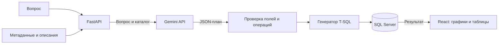

# AI BI for Easy Analysis

Локальное web-приложение: **вопрос на естественном языке → Gemini → проверенный план → SQL Server → графики и таблицы**.

Это однопользовательский прототип, а не готовая SaaS-платформа. Для запуска нужны собственная БД SQL Server с представлениями и API-ключ Gemini. Реальные настройки, метаданные и результаты автора не включены в репозиторий.

## Возможности

- Текстовый запрос, уточнения ИИ и изменение открытого отчёта.
- Каталог полей из SQL Server; редактирование описаний и бизнес-правил в браузере.
- До четырёх блоков: KPI, столбцы, линия или таблица.
- SUM, AVG, MIN, MAX, COUNT, COUNT DISTINCT; до двух группировок.
- Временная группировка, фильтры AND, сортировка.
- Локальная история, сохранение снимков и обновление без обращения к ИИ.
- Просмотр SQL и параметров под графиком.
- До трёх попыток при временных HTTP 502/503/504 от Gemini.

## Как это работает



Модель не исполняет SQL или программный код. Backend принимает ограниченный структурированный план, проверяет имена по каталогу и параметризует фильтры. Числа вычисляет SQL Server. Это не заменяет ограничение прав SQL-логина и проверку бизнес-смысла отчёта.

## Требования

| Компонент | Требование |
|---|---|
| Python | 3.11+ |
| Node.js | 22.12+; рекомендуется совместимая LTS |
| npm | В комплекте с Node.js |
| SQL Server | Проверено на версии 2019 |
| ODBC | Microsoft ODBC Driver 17 for SQL Server |
| SQL-доступ | SQL Authentication, логин с SELECT на разрешённые представления |
| Gemini | Ключ, доступная модель и квота Google-проекта |
| Браузер | Современный Edge или Chrome |

Основное проверенное окружение — Windows. Linux/macOS требуют unixODBC и Microsoft SQL Server ODBC driver; сквозная проверка на этих ОС не проводилась. Driver 18 можно указать в настройках, но параметры TLS для него нужно проверить отдельно.

[Установка драйвера Microsoft](https://learn.microsoft.com/sql/connect/odbc/download-odbc-driver-for-sql-server).

## 1. Скачать

```powershell
git clone https://github.com/MerdanOchanov/ai-bi-for-easy-analysis.git
cd ai-bi-for-easy-analysis
```

Без Git: **Code → Download ZIP** на GitHub, распакуйте и откройте терминал в папке с `run.py` и `package.json`. Все команды ниже выполняются из корня проекта.

## 2. Установить зависимости

Windows PowerShell, без активации окружения и изменения Execution Policy:

```powershell
python -m venv .venv
.\.venv\Scripts\python.exe -m pip install -r requirements.txt
npm.cmd ci
```

Linux/macOS:

```bash
python3 -m venv .venv
.venv/bin/python -m pip install -r requirements.txt
npm ci
```

Далее команды приведены для Windows. На Linux/macOS замените `.\.venv\Scripts\python.exe` на `.venv/bin/python`, `npm.cmd` на `npm`.

## 3. Создать настройки

```powershell
.\.venv\Scripts\python.exe setup_local.py
```

Создаются `config.json`, `.env`, `business_context.json` из публичных шаблонов. Существующие файлы **не перезаписываются**. Рабочие файлы исключены из Git.

В `config.json` заполните `database`:

```json
{
  "type": "sqlserver",
  "version": "2019",
  "driver": "ODBC Driver 17 for SQL Server",
  "host": "YOUR_SQL_SERVER",
  "port": 1433,
  "database": "YOUR_DATABASE",
  "auth_mode": "sql",
  "username_env": "DB_USERNAME",
  "password_env": "DB_PASSWORD",
  "allowed_views": ["dbo.YourSalesView"],
  "connection_timeout_seconds": 10,
  "query_timeout_seconds": 30,
  "max_result_rows": 1000
}
```

Это секция, не весь файл: сохраните также `ai`, `config_version` и `business_context_file`. Укажите реальные адрес, порт, БД, имена представлений. Для локального/именованного экземпляра при доступном обнаружении можно оставить `port: null`. Обратный слеш в JSON экранируется: `"SERVER\\INSTANCE"`.

Пустой `allowed_views` запрещает все наборы. `auth_mode` поддерживает только SQL-логин/пароль; Windows Authentication ещё нет.

В `.env`:

```dotenv
DB_USERNAME=YOUR_READ_ONLY_LOGIN
DB_PASSWORD=YOUR_PASSWORD
AI_API_KEY=YOUR_GEMINI_API_KEY
```

Используйте отдельный SQL-логин с SELECT только на необходимые представления. Не используйте административную учётную запись для постоянной работы.

Парсер `.env` простой: `KEY=value`, без внешних кавычек и встроенных комментариев. Пустые строки и строки с `#` пропускаются. Переменные окружения `DB_USERNAME`, `DB_PASSWORD`, `AI_API_KEY` имеют приоритет над файлом.

## 4. Подключить Gemini

1. Создайте ключ в [Google AI Studio](https://aistudio.google.com/apikey).
2. Проверьте доступность модели и квоты именно своего Google-проекта.
3. Запишите ключ в `.env`.
4. В секции `ai` установите `external_data_policy: "question_and_schema"`, если разрешаете отправку контекста. По умолчанию шаблон использует `"deny"`.

Начальная модель — `gemini-2.5-flash`; заменяется через `ai.model`. Используется официальный endpoint `https://generativelanguage.googleapis.com/v1beta`.

[Тарифы](https://ai.google.dev/gemini-api/docs/pricing), [квоты](https://ai.google.dev/gemini-api/docs/rate-limits), [диагностика Google](https://ai.google.dev/gemini-api/docs/troubleshooting). Квоты и доступность моделей меняются. Приложение не подключает биллинг, но и не может определить по ключу, бесплатный ли Google-проект: проверьте это в AI Studio.

**Что передаётся:** текст вопроса, имена/типы/описания полей, описание компании, бизнес-правила, предыдущий план. **Не передаётся:** пароль БД, строки и результаты SQL, SQL-определения представлений. Если чувствительные значения введены в вопрос или описание, они входят в отправляемый текст. На бесплатном уровне Google может использовать входы и выходы для улучшения продуктов согласно условиям сервиса.

## 5. Проверить БД и загрузить каталог

```powershell
.\.venv\Scripts\python.exe inspect_database.py --check
.\.venv\Scripts\python.exe inspect_database.py --sync-catalog
```

Синхронизация читает метаданные разрешённых представлений и комментарии `MS_Description`, сохраняет их в `business_context.json`. Строки таблиц не копируются. При повторном запуске сохраняются введённые описания совпадающих полей.

Поиск представлений и просмотр столбцов:

```powershell
.\.venv\Scripts\python.exe inspect_database.py --search Sales
.\.venv\Scripts\python.exe inspect_database.py --schema dbo --view YourSalesView
```

Поиск — административная CLI-операция по метаданным, доступным SQL-логину, без ограничения текущим allowlist. Он не разрешает найденные представления автоматически.

## 6. Собрать и запустить

```powershell
npm.cmd run build
.\.venv\Scripts\python.exe run.py
```

Откройте [http://127.0.0.1:8000](http://127.0.0.1:8000). Терминал должен оставаться открытым. Остановка — `Ctrl+C`.

Повторный запуск требует только `run.py`. После изменения frontend повторите сборку; после изменения Python перезапустите сервер. Настройки и ключ перечитываются при обращении.

Сервер слушает только loopback. Здесь нет аутентификации SaaS: не выставляйте этот сервер в интернет без отдельной доработки.

## 7. Описать бизнес-логику и построить отчёт

1. Откройте «Данные и правила».
2. Задайте общие определения показателей.
3. Для представления поясните, что означает строка, какие документы включены, какие есть исключения.
4. Для поля укажите смысл, валюту/единицы и особенности использования.
5. Сохраните пояснения, перейдите в «ИИ-аналитику».

Для условного представления `dbo.YourSalesView` с полями `SaleDate`, `Amount`, `Category`:

```text
Из dbo.YourSalesView покажи сумму Amount по месяцам SaleDate за 2025 год.
```

Этот пример не создаёт представление. Подставьте поля своего каталога и период с данными. На уточнение ИИ ответьте в том же поле. Под графиком доступны SQL/параметры, переключение на таблицу, сохранение. «Обновить данные» повторяет расчёт без нового вызова Gemini.

Описания не изменяют исходную БД. Синтаксически правильный план ещё не означает верный бизнес-показатель: сравните первый результат с контрольным расчётом.

## Границы прототипа

| Область | Ограничение |
|---|---|
| Источники | Только SQL Server |
| ИИ | Только Gemini API |
| JOIN | Нет; один график читает одно представление |
| Выражения | Нет арифметики между полями и произвольных формул |
| Фильтры | AND, без произвольного OR/HAVING |
| Группы | До 200 на блок; ограничение обозначается |
| Визуализация | График рисует до 24 групп, таблица — весь полученный результат |
| Параллельность | Один отчёт; следующий запрос получает сообщение о занятости |
| Хранение | Локальные JSON-снимки; автоматической очистки нет |
| Редактор | Смена вида графика относится к просмотру, не меняет сохранённый план |
| SaaS | Нет аккаунтов, ролей, подписок, расписаний и изоляции компаний |
| Экспорт | PDF и другие форматы не реализованы |

SUM/AVG используют `decimal(38,6)`, передаются строками; отображение округляется до двух знаков, графики используют числовое приближение JavaScript. Ограничение групп применяется после агрегации исходных строк.

История показывает последние 100 файлов. Обновление создаёт новый снимок. Между графиками нет общей транзакции/единого снимка БД. Нет полноценного версионирования бизнес-правил.

## Структура

```text
backend/                       API, Gemini, каталог, генератор T-SQL
frontend/                      React + TypeScript
 tests/                        Синтетические тесты
config.example.json            Шаблон подключения
business_context.example.json  Пустой шаблон каталога
.env.example                   Пустые секреты
setup_local.py                 Инициализация без перезаписи
inspect_database.py            Подключение и метаданные
run.py                         Локальный запуск
```

Не публикуются: `.env`, `config.json`, `business_context.json`, `data/`, `dist/`, `node_modules/`, реальные скриншоты, внутреннее ТЗ и сценарии с данными автора.

## Тесты

```powershell
.\.venv\Scripts\python.exe -m unittest discover -s tests -v
npm.cmd run build
```

Модульные тесты используют синтетические метаданные и подменённые ответы ИИ, не требуют настоящей БД/ключа. Проверка статики выполняется после сборки. Реальное соединение проверяется отдельно командой `inspect_database.py --check`.

Опционально, при установленном Edge и запущенном сервере:

```powershell
node check_browser.mjs
```

Проверяет страницу, каталог и встраивание. Создаёт `browser-check.png`, исключённый из Git.

## Устранение ошибок

| Симптом | Действие |
|---|---|
| Страница недоступна | Запустите `run.py`, проверьте порт 8000 |
| Пустой интерфейс / нет сборки | `npm.cmd run build`, перезапуск, обновление без кэша |
| ODBC driver missing | Установите драйвер, проверьте точное имя в конфиге |
| SQL connection failed | Адрес/порт, пароль, SQL Authentication, БД, TLS |
| Пустой каталог | Заполните allowlist, выполните `--sync-catalog` |
| Ключ отсутствует | Заполните AI_API_KEY; кнопка UI проверяет наличие, не действительность ключа |
| Gemini 403 | Права ключа, проект, регион |
| Gemini 404 | Доступность модели, настройка ai.model |
| Gemini 429 | Квоты запросов/токенов в AI Studio |
| Gemini 503 | До трёх попыток с паузами 2/4 секунды, затем понятная ошибка |
| SQL timeout | Сузьте период, проверьте план выполнения в БД |
| Неизвестное поле | Синхронизируйте каталог и уточните запрос |

Каждый вызов ИИ имеет сетевой таймаут; повторы увеличивают общее ожидание. Автоматического перехода на другой платный сервис нет.

## Публикация и вклад

Перед commit проверьте `git status`, `git ls-files`, `git diff --cached`. Не используйте `git add -f` для рабочих настроек. См. [SECURITY.md](SECURITY.md).

Для issues/PR используйте синтетические примеры, без реальных ключей и отчётов. Открытая лицензия пока не выбрана владельцем: публичная доступность исходников сама по себе не предоставляет лицензию на перераспространение.
